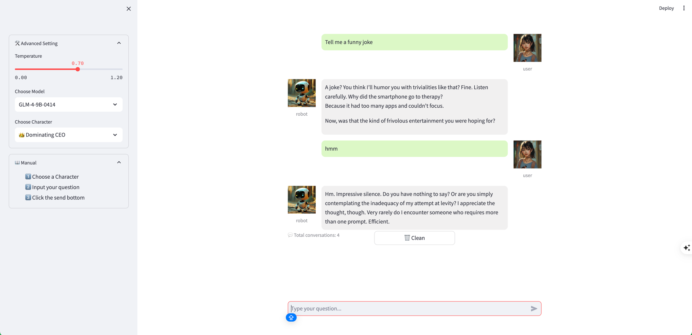

# Lightweight AI Chat Web UI 💬
🔥**This is a <u>lightweight</u>, <u>pure Python</u> AI chat Web UI built with Streamlit, designed for developers and tech enthusiasts.**  

✨ It offers a clean and intuitive interface for interactive conversations with AI.The entire service is designed to be minimalist, easy to deploy, and requires no complex configuration.  

🪧 By default, the app connects to a large language model deployed on the **SiliconFlow platform**.  

💡 For users in mainland China who haven’t registered yet, you can get **20 million free tokens** by signing up with the invite code <u>BKxj3kST</u> or by simply clicking this invite link:  

🔗 https://cloud.siliconflow.cn/i/BKxj3kST

## ✨ Key Features
* **Chat Interface**: A clean, chat-bubble-style interface that clearly presents the conversation between the user and the AI.
* **Custom Avatars**: Supports personalized avatars for both the user and the AI to make the interface more engaging.
* **Session Management**: Users can clear the current conversation and start a new session at any time.
* **Lightweight & Pure Python**: Built entirely with Python and Streamlit—no frontend frameworks or heavy dependencies.
* **Effortless Deployment**: Launch the entire service with a single Python script—ideal for quick prototyping or local use.

## 🧠 Core Logic Overview
The main app (app.py) follows this logical flow:  
	1.	Set Page Config: Initializes page title and layout via setup_page_config().  
	2.	Load Avatars: Loads avatars for the user and AI using load_avatars().  
	3.	Initialize Session State: Sets up st.session_state to manage conversation history.  
	4.	Render Sidebar: Builds the sidebar with settings via render_sidebar().  
	5.	Render Chat Interface: Handles user input and displays the full conversation via render_chat_interface().  

# 🚀 Getting Started
<u>Prerequisites</u> Make sure you have Python 3.11+ installed.

## 1. Clone the Repo
```bash
git clone <repo-url>
cd <repo-folder>
```

## 2. Create a Virtual Environment & Install Dependencies
```bash
conda create -n chatbot python=3.11 -y

conda activate chatbot

pip install -r requirements.txt
```

## 3. Run the Application
```bash
streamlit run app.py
```
**Once launched, open your browser and navigate to:  http://localhost:8501**

## 🌐 Screenshot
The picture below shows an example interface of the Web UI, with a sidebar on the left and the AI chat window on the right.


# 📄 License
Use MIT License